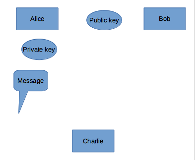

## Symmetric Encryption

The same key is used in symmetric encryption and decryption steps.

Symmetric encryption methods:

- AES (Advanced Encryption Standart)
- DES (Data Encryption Standart)
- 3DES
- RC4
- A5
- Playfair
- Blowfish
- Twofish
- IRON
- Vigenere?

Advantages of Symmetric Encryption:

- Encryption and decryption are fast, easy to implement with hardware.

Difficulties of Symmetric Encryption:

- The key is hard to store.
- Does not provide authenticity. Data may be encrypted by anyone with the same key.

### DES

All content in the message is converted to bit. The block size of DES is 64 bits.We can think of 8 characters as 1 byte is 8 bits. In other words, 64 bits or 8 letters are imported into a block. We also have a 64-bit password.

## Asymmetric Encryption

In asymmetric encryption, different keys are used for encryption and decryption. These switches are public and private. The public key is used for encryption and verification, while the private key is used for decryption and signing.

The data encrypted with the recipient’s public key can only be opened with the recipient’s private key. For this reason, the sender sends the data by encrypting it with the public key of the receiver. It is ensured that this encrypted data can only be read by the receiver having a private key.

There are 3 ways to use the public key:

- Alice encrypts the message with own private key.Sends the encrypted message to Bob.The public key is the opposite of the secret key, Bob opens the encrypted message using the public key. Message is a meaningful message when Bob opens the message, Bob understands that her message.Certificates, e-signatures

- Bob can send the message by encrypting it with the public key. Alice can open the encrypted message with its own private key, Alice can read the message.

- Bob encrypts the message with own private key. Bob also encrypts it with Alice’s public key.Alice decodes the encrypted message with her own private key. Because you know, her private key opposites with her public key. With Bob’s public key, she decodes the secret key in the message. Thus, the message can be read.

### RSA

It was discovered in 1977 by Ron Rives, Adi Shamir and Leonard Aldeman. The name of the encryption method consists of the initials of these three names.

How does it work:

- Two sufficiently large numbers: These numbers are p and q in our example.
- n = p*q is calculated. It is the product of two prime numbers and accepts it as a base (modulus) for both public and reverse passwords.
- The totient value is calculated. For this example, since both of the factors are prime numbers, n (n) = (p-1)*(q-1).
- The calculated totient function value (φ (n)) is equal to that of a number that is equal to 1 < e < φ (n) occurs.
- Keys can be declared from this budget a mode is calculated.: : d*e ≡ 1 mod ( φ(n) ). This d value is stored as the correct password. This number needs to be calculated by extended euklite (expanded euclide).

## Encryption process

For encryption, Alice publishes its own public password (n, e). Receiving this password, Bob encrypts the message in the following way:

$$c=m^e mod n$$

m is the text to be encrypted, e and n is Alice’s public password

## Opening the password process

Alice uses the following formula when opening the message sent by Bob:

$$m=c^d mode n$$

The encrypted text to be opened here is c, and the private password of Alice is indicated by d. n is the modulus with the base value.

For Example:

- Two prime numbers are selected
`p = 61 and q = 53`

- The value of n is calculated in the form of `n = pq n = 61 * 53 = 3233 Totient function is calculatedφ(n)  = (p-1) (q-1)`

`φ(n)  = (61-1) (53-1) = 3120`

- the totient function is the result of which the prime is selected and a number greater than 1 is selected `e> 1 => e = 17 (between 3120 and prime), this number is also the public password.`

- To be a private password, a number d is selected:
There is a d number `d*e ≡ 1 mod(n), d = 2753 (because 17 * 2753 = 46801 = 1 + 15 * 3120)`. During the calculation of this number, extended euclide method was used.

For example:

- You get 123 messages to be sent:

$${123^{17} mod 3233 = 855}$$ contains encrypted text.

- The opposite will be applied to the transaction:

$$855^{27} 53  mod  3233 = 123$$ Obtain the original message as 123
