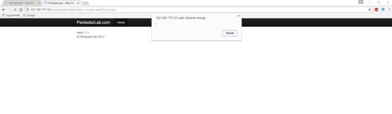

## XSS

**Adım -1:** Bilgisayar korsanları yani hackerler, genelde kullanıcı adları, şifreler veya fatura bilgileri gibi kullanıcı verilerini incelemek amacıyla kötü niyetli bir script dosyası tasarlarlar.

**Adım -2:** Hackerlar, kötü amaçlı scripti bir web sitesine ekler. Komut, yasadışı bir ATM Skimmer’ın arkasındaki konsepte benzer şekilde, kullanıcıya gizli bir katman görevi görür. ATM Skimmer’ın ne olduğunu merak eden arkadaşlarımız için kısa bilgi verelim. ATM Skimmer, ATM lerin kart giriş boğazına takılan kullananın görmediği ve makineden bağımsız çalışan bir nevi kopyalama aletidir. Kartınız Skimmer’in içinden geçerken verileriniz kopyalanır.

**Adım -3:** Hackerlar bundan sonra, kullanıcı verilerini başarıyla toplarken olaydan geri bildirim alırlar.

### XSS(Cross Site Scripting) Türleri

Başlamadan önce XSS Türleri hakkında kısaca bilgi vereyim.3 Çeşit XSS Türü vardır:

- **Reflected XSS:** Kullanıcının girilmesi beklenen parametre yerine Javascript  kodu girerek bunu ekrana yansıtması ile tespit edilebilen XSS çeşitidir.
- **Stored/Persistent XSS:** Adında anlaşılacağı üzere kalıcı XSS türüdür.Bu sefer girilen payloadlar anlık olarak yansımaz bir veritabanına yada başka bir yere kayıt edilir daha sonradan ziyaret edildiğinde çalışan XSS çeşitidir.
- **Dom XSS:** Dom (Document Object Model) XSS Dom lardan kaynaklanan XSS dir.Genelde # işaretinden sonra payload denenmesi ve sayfa yenilendiğinde alert alındığında DOM XSS var denilen XSS açıklığıdır.İşin teorik bilgisi DOM nesnesinden kaynaklandığı için en tehlikeli XSS türü olarak anılmaktadır.

### XSS ile Neler Yapılabilir?

XSS ile javascript kodları çalıştırabilmekteyiz.Burada zararlı kodlar kullanıldığında  Cookie çalma,sayfanın içinde başka sayfaya yönlendirme.Sitemize zararlı kodlar gömerek istedikleri başka saldırılar gerçekleştirebilirler.Web dünyasında önemli ve kritik açıklıklar arasında yer almaktadır.

Bizim için altın değerinde olan alanlar ise sitede ki arama kutuları, url sonları, hata mesajları ve önizleme gibi kısımlardır. Buraları kullanarak siteyle iletişim kurmaya ve bilgi almaya çalışırız.

En basitinden **alert(1)** payloadımızı girerek ekrana alerti bastırarak XSS imiz var mı diye kontrol yapabiliriz.alertin içine isim yazı yazmak isterseniz **alert(“XSS”)** tarzında yazabilirsiniz.Fakat bazen tırnak işaretlerinin filtrelenmesinden dolayı direk sayı girerek tırnak kullanmadan alert almak daha sağlıklı sonuçlar vermektedir.



Burada pop-up ekranının çıktığını gördük ancak eğer ki scriptimiz yazılımcı tarafından filtrelenmiş olsaydı o zaman payloadımızda ufak değişikliklerle scriptimizi yedirmeye çalışacaktık. Örnek Kullanımlar:

### 1. Parametreye Script Yedirmeye Çalışırken:

```JS
alert(1)
<script>alert(1)ript>
<svg onload=alert(1)>
```

Eğer ki alert fonksiyonunda filtreleme yapıldıysa:

`<svg onload=prompt(1)>`

Eğer girdiğimiz değeri bir değişkene atıyorsa yazılımcı o zaman:

- payload olarak “; alert(1);” girdiğimizde önce değişkeni kapatıp sonra diğer ” nığı kapatarak syntax hatası almadan alertimizi başarıyla verdirmiş oluruz.

Eğer çift tırnak gibi çok kullanılan bir yöntemi filtrelemişse bizde tek tırnak ile devam ederiz 🙂

`‘; alert(1);’`

### 2. HTML Forma Payload Girerken:

Belirli tetiklenmelere bağlı olarak payloadımı çalıştırabilirim mesela benim sık kullandığım method fare hareketiyle pop-up ekranını çıkarmaktır:

`/” onmouseover=”alert(1);`

Arkadaşlar bir çok bypass yöntemi ile yazılımcının filtrelemelerini geçerek alert verdirebiliriz.Çok fazla sayıda XSS payloadı bulunmakta ve türemekte duruma koda göre BugBounty (Bugcrowd,HackerOne vb.)  ile uğraşan arkadaşlar kendilerini geliştirip çok farklı payloadlar bulmaktadır.

#### XSS’den nasıl korunabilirim?

Blacklist değil WHİTELIST kullanılmalı ! Bize ne lazımsa onu almalıyız sadece.


## CSRF Nedir ?

CSRF (Cross Site Request Forgery) genel yapı olarak sitenin açığından faydalanarak siteye sanki o kullanıcıymış gibi erişerek işlem yapmasını sağlar.

Genellikle GET requesleri ve SESSION işlemlerinin doğru kontrol edilememesi durumlarındaki açıklardan saldırganların faydalanmasını sağlamaktadır.

Saldırganın herhangi bir web sayfasına yerleştirdiği Js veya Html kodlarıyla yetkilinin oturum bilgilerini çalma olayıdır. Üstte de belirttiğimiz gibi, yetkilinin haberi olmaksızın yapılan bir işlemdir. Bu olayda önemli olan, saldırganın kurban için kodladığı web sayfasını kurban’ın açmasıdır. kurban web sayfasını açtığı takdirde, session (Oturum) bilgileri – saldırganın kurnazlığına bağlıdır biraz da – saniyeler içerisinde kurbana fark ettirmeden değiştirilebilir.

Yetkilinin oturum bilgilerini kurnaz bir biçimde ele geçirdikten sonra korsan, kurbanı tamamen sistemden saf dışı ederek sisteme dahil olur ve kontrol mekanizmasını elinde tutar.

Bir site hayal edelim.

`DemoVuln.Com/Passwd.php`

Bu sayfa, bir sitenin kullanıcı şifresini değiştirmeye yarayan sayfa olsun. Kullanıcının şifresini değiştirdiğini düşünürsek, php dilinde, get methodu ile yazılmış bir sayfada tepki enter tuşuna basıldığı vakit şu şekilde gerçekleşecektir:

`DemoVuln.Com/Passwd.php?pass=yenisifre`

Görüldüğü üzere url direkt olarak yansıdı ve yeni şifremiz “yenisifre” olarak tarayıcıda dahi belirdi. Bu, en basit php yazma methodudur ve günümüzde pek az kullanıcı tarafından kullanılır. Yine de, konuyu anlamanız açısından en basit yoldan anlatmak istiyorum. Biraz daha açıp, kaynak kodlarımıza göz gezdirdiğimizde, şöyle bir şey çıkar karşımıza.

```html
<Form Method="Get" Action="Passwd.php">
<Input Type="Text" Name="pass" />
<Input Type="Submit" Name="Submit" Value="Submit" />
</Form>
```

Şimdi dilerseniz kodları da sizlerin anlaması açısından biraz daha açalım.

- Tarayıcı, sunucudan öncelikle “get” methodu ile bilgileri çekiyor.
- Passwd.php adlı dosya çalışıyor.
- Form, Passwd.php dosyasına göre hareket ederek verileri çekiyor. Passwd.php sayfasından alınan, yani input type’a gönderilen şifre bizim database’îmizde değiştiriliyor.

### CSRF’den nasıl korunabilirim ?

#### Post Modülü Kullanma

Günümüzde belli başlı küçük sistemlerde işe yarasa da, yine de küçük sistemler için hayat kurtarıcı bir methoddur. Saldırgan **“get”** modülü yerine **“post”** modülü kullanıldığında tarayıcı üzerinde şifrenin değiştiğini göremeyince işin başarısız olduğunu zannedebilir. Ancak bu sadece yeni yetme saldırganlar için geçerlidir ve derine inen pek çok uzman saldırgan da vardır. Bu gibi durumlarda post methodu yetersiz kalır ve yeni şeyler aramak zorunda kalırsınız.

#### Captcha Kullanımı

**Captcha** kullanımı sadece korsandan değil aynı zamanda bot ve zararlı yazılımlardan da sisteminizi koruyan bir yöntemdir ve bu tür durumlarda kullanılması önemlidir.