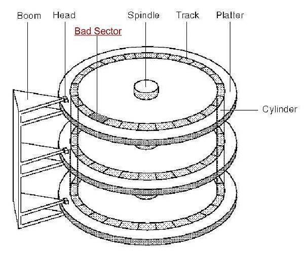
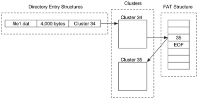
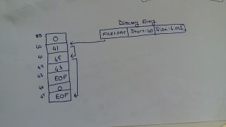
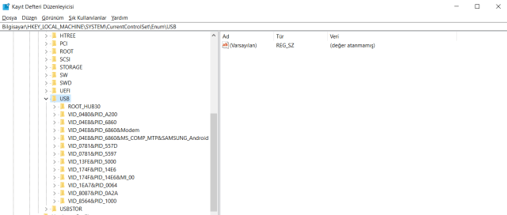

## Adli Bilişim Nedir?

Adli bilişim, bilişim sistemleri üzerinden genellikle veri olarak elde edilen delillerin toplanaması , saklanması , derlenmesi ve analizi konusunda çalışan bir bilim dalıdır. Bu alanda çalışırken adli bilişim uzmanının tabiri caizse şeytanın aklına gelecek detayların ve senaryoların üretilmesi gerekmektedir. Peki ne gibi şeylerle uğraşırlar ? Network forensics , Disk forensics , Mobile forensics , Memory forensics vs gibi … Bu yazımda daha çok disk forensics üstünde durmayı planlıyorum. Bu konular dışında bir adli bilişim uzmanının hukuki süreçler konusunda bilgili olmalı. Mesela ACR gibi bir uygulamayla kişi konuşmalarını ses kaydı altına aldığında ve bunu delil olarak sunmaya kalkıştığında mahkemede geçersiz olabiliyor. Ya da twitter’dan ekran görüntüsü aldığınızda bunu delil olarak nitelendirdiğinizde de aynı şekilde. Çünkü kişi html kodlarını değiştirip bunu iftira durumuna da dönüştürebilir.

Biraz daha teknik kısmına gelecek olursak , adli delil olarak bir sabit diskin imajını alırken iki yolumuz vardır: Fiziksel İmaj ve Mantıksal İmaj. Fiziksel imaj dediğimiz diskin tamamının kopyalanmasıdır. Mantıksal imajsa sabit diskin tamamının değil sadece bazı bölümlerinin imajının alınmasıdır. RAID sürücülerin veya şifrelenmiş sürücülerin imajlarının alınmasında mantıksal imaj almak önerilir. 

## Disk Forensics

Delil olarak nitelendirilen disk üzerinden silinmiş dosyaların geri getirilmesi veya gizlenmiş, bozulmuş önemli dosyaların kurtarılması işlemini içerir. Bunun disk yapısı çok iyi bilinmelidir.

Bilgisayardan herhangi bir dosyayı sildiğinizde, sabit disk üzerinde silinen dosya için ayrılan alan yeni veri ile doldurulamazsa o veri kalıcı olarak silinmemiş demektir. Siz sildiğinizi sanarsınız ancak bir adli bilişim uzmanı çok uzun süre geçmesine rağmen o dosyanıza ulaşabilir. SSD(Solid State DRİVE -Katı Hal Sürücüler)’lerde durum biraz daha farklıdır.SSD’lerde veriler bloklar halinde saklanır. Yani bloğun silinmesi ile bloğun içeriği ön belleğe kayıt edilir, blok içeriğinin silinmesi ile ön belleğin üzerine yazılan bloğu siler, yeni veriyi ön belleğe yazar ve bloğu yeni veri ile yapılandırır.

Diskte bilginin tutulduğu alanlar Platter olarak adlandırılır. Günümüzde bir diskte 3 yada 4 tane platter bulunur. Platterlar gözle görünemeyen tracker(iz) sahiptir.

Harddisk ham haldeyken hangi bilginin nerede olduğunu anlamak için CHS(Cylinder Head Sector) kullanırız. CHS açılımından da görebileceğimiz gibi böylece bilginin hangi plakta, alt/üst yüzeylerden hangisinde olduğunu, kaçıncı sektörde olduğunu bilebiliriz.

Her bir sektör 512 Byte(A5 kağıdının yarısı kadar bilgi) alan işgal eder. Yani siz 1 GB boyutunda bir film izlemeye çalıştığınızda harddisk yaklaşık 1 milyon tane sektöre yazma işlemi yapar. Bununla baş etmek için dosya sistemleri gruplama yöntemini kullanmışlardır. 10 sektörü 1 grup içine alarak bunun adına da Cluster denmiştir.

USB taktığınız zaman size 64 sektörü(16 GB) bir araya getirerek 1 cluster oluşturur. Ve veriler buraya yazılır. Bu arada 1 cluster içerisine aynı anda birden fazla dosya yazılamaz.

Bir word dökümanı 10 KB civarındadır. Elimizde 32 KB boyutunda bir cluster olduğunu varsayalım. Geriye kalan 22 KB boş alan olarak kalır. Bu boş alanlar birleştiği zaman aslında diskin yarısının boşta olduğunu görebiliriz. Yani elimizde bulunan 500 GB boyutunda hard diskin 250 veya 300 GB boyutunu kullandığımızı söyleyebiliriz.

**Diskin üzerine herhangi bir veri yazılmadıysa o veri kurtarılabilir!**

Hard diskler 5400 RPM,7200 RPM ve 10000 RPM ile çalışabilir. Bunun anlamı şudur hard disk üzerindeki okuyucu kafanın disk üzerinde ne kadar hızlı gidip geldiğini ifade eder.

Bilgisayarınızı açtığınızda ilk olarak güç aldığında bu BIOS tarafına iletilir. BIOS ise ilk sinyalini hard diske iletir. Ve bu gelen sinyal sürekli ilk olarak aynı noktaya gelmek zorundadır. Bu noktaya MDR(Master Boot Record) denir. Sıfırıncı sektör de diyebiliriz. MBR bilgisayar için çok önemli bir kısımdır.Çünkü içerisinde partition bilgisini, işletim sistemi bilgisini ve işlemlerin çalışma sıraları vs bilgileri bulundurur.

En bilindik hard disk modelleri -> Western Digital, Samsung, Seagate.

## Dosya Yapıları

Windows sistemleri genelde FAT ve NTFS dosya sistemi ile çalışır. Mac ise HFPS ile çalışır.

FAT (File Allocation Table) dosya sisteminde Directory Entry’de hangi datanın hangi cluster da olduğunu tutar.

Defragment: 45. Cluster’ı 42. Cluster’a getirip dosyaya hızlı ulaşmamızı sağlar. Parçalanmış büyük dosyaları mümkün olduğu kadar birbirine yakın tutmaya yarar.
Özetlemek gerekirse bizim için üç tane önemli kısım vardır.

- Data
- Directory Entry
- FAT Table

İki senaryo hazırlayalım ve adli bilişim uzmanı gözünden bakalım:

- Data Alanı ve Directory Entry alanına ulaşabildiğimizi ancak FAT Tablosuna ulaşamadığımız durum olursa dosyayı kurtarabiliriz.
- Data Alanı ve FAT Tablosuna ulaşabildiğimizi ancak Directory Entry alanına ulaşamadığımızı düşünürsek ise sadece dosya ismini kurtaramayız ama datayı elde edebiliriz.

Olay yerinden elimize bir usb getirildiğini varsayarsak yapmamız gerekenleri anlatmak gerekirse ilk olarak usb imajını alarak gerçek usb dokunmamamız gerekmektedir.

Yazma koruma cihazımıza USB takıldıktan sonra bilgisayara bağlanır. Bunun nedeni bilgisayarın register kısmı USB’yi algıladığı zaman otomatikmen kod yükleme çalışır ki uyumlu olarak çalışabilmesi için. Ancak bu bizim istemediğimiz bir şeydir çünkü USB’nin orjinal halini bozarız ve elimizde hash değerini değiştirmiş oluruz. Bu yüzden kesinlikle USB cihazını direk olarak bilgisayara takmamalıyız. Ve ardından forensic cihazımızı(forensic tool,encase vb.) takıp kurtarma işlemine başlayabiliriz.

Alınan imajlar Raw, AFF ve E01 foramtında olabilir.

Bir disk yapısına bakacak olursak;

#### Kullanıcı tarafından adreslenebilir kısımlar

- **HPA(Host Protected Area):** İşletim sistemi tarafından görülmeyen ve işletim sisteminden gizlenmiş bir sabit disk alanıdır. Donanım üreticileri tarafından ilgili cihaza ait kurulum ve sürücü dosyalarını saklamak için kullanılır.
- **DCO(Device Configuration Overlay):** BIOS, işletim sistemi veya kullanıcı tarafından erişilemez.

Eğer kullanıcı tarafından adreslenebilir alan ile genel disk alanı arasında büyük bir boyut farkı varsa, HPA ve DCO alanları adli incelemeye alınmalıdır. Özellikle HPA alanın da alınacak imaj dosyası, adli tıp raporunda önemli bir yere sahiptir.

Bilgisayara takılan her usb cihaza ait detaylı bilgiler registry’de kayıtlı olarak tutulur.

