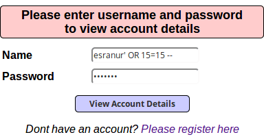
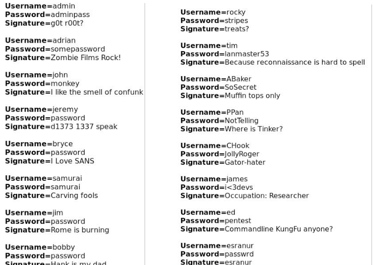
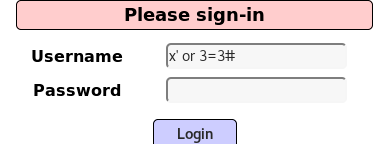
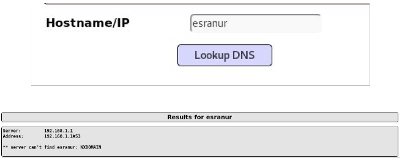
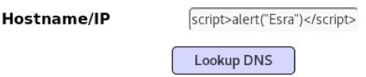
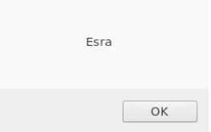
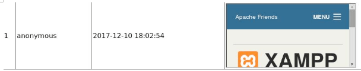
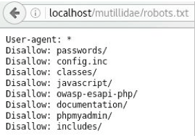

## 1. SQL Injection

İlk başta normal kullanıcı gibi giriş yapmayı deniyorum. Ve doğal olarak siteye herhangi bir kayıdım olmadığı için giriş yapamıyorum. Ancak benim amacım zaten siteye giriş yapmak değildi. Benim amacım bana hata mesajını gönderirken bilgilerimi ekrana yazdırıp yazdırmadığını kontrol etmekti. Ve yukarıda ki ekranda da görüldüğü gibi Result for “esranur”, 0 records found şeklinde dönüş aldım. Yani bu demek oluyor ki sitede açık olabilir eğer sistemde zararlı karakterler filtrelenmiyorsa istediğim her bilgiyi ekrana bastırmayı deneyebilirim.

Bu işlemden sonra yeni bir account oluşturdum. Name: esranur Password: passwrd olacak şekilde bilgilerimi veri tabanına yollatarak bir hesap açmış oldum.

Web uygulamalarında birçok işlem için kullanıcıdan alınan veri ile dinamik SQL cümlecikleri oluşturulur. Örneğin; “SELECT * FROM Products* örnek SQL cümleciği basit şekilde veri tabanından web uygulamasına doğru tüm ürünleri döndürücektir. Bu SQL cümlecikleri oluştururken araya sıkıştırılan herhangi bir meta-karakter SQL Injection’a neden olabilir.

Giriş sayfasına SQL Injection açıkları denerken farkı veritabanlarına ait özel karakterler ile giriş yaptım. Bu veritabanları MySQL , Oracle SQL ve diğer popüler veritabanları olabilir. Örnek verirsem çoğu veritabanı / veya * kullanrak yorum satırı eklemeyi kullanır. Bunun gibi özel karakterler deniyorum.

Genelde SQL Injection yapılırken kullanılan özel karakter resimde görüldüğü gibi tırnak karakteridir. Ve beklediğimiz gibi hata mesajı aldık .

Bu hata mesajı bize yol göstericidir. Yani bize veritabanı olarak hangi SQL türü kullandığını söylüyor:

`opt/lampp/htdocs/mutillidae/classes/MySQLHandler.php`

Kullanılan veritabanının MySQL veritabanı olduğunu öğrenmiş olduk. Ve aynı zamanda hangi SQL sorgusunu çalıştıracağımızı bize söylemiş oldu.Yani bu demektir ki SQL Injection’a ait herhangi bir kontrol içermemektedir.

Burada biraz SQL bilgisine girmek istiyorum.Tırnak olayından bahsetmiştim. 15=15 eşitliği her zaman doğru bir ifade olacağı için her türlü true değeri dönecektir. Ve araya koyulan OR işareti ise sorgu da bu koşullardan biri sağlandığında sorgunun yapılması gerekmesini sağlar. Yani kısaca burada manuel olarak elle denemeler yaparak veritabanında ki tüm verileri çekmeye çalıştım.

Burada beklemediğim bir sonuç aldım. Hata kısmında username kısmında sadece tırnak kalması gerekmekteydi.Yani o zaman sorgunun çalıştığını anlardım…

Dikkat edecek olursak bana dönen SQL Hatası şu şekildedir:

`SELECT * FROM accounts WHERE username=’esranur’ AND password=’passwrd’`

Bu sorgu bize çok şeyi anlatmaktadır.Aslında sorgular çok basit bir mantık içinde çalışmaktadır.Eğer çalışan sorgunun sonucu TRUE ise bize girdiğimiz user’a ait bilgileri döndürecektir. Bu sorguda kullanıcısı esranur olan ve şifresi passwrd olan kullanıcı var ise bana sonucu döndür. O halde biz bu sorguyu kolay bir şekilde değiştirebiliriz.

Bizim türeteceğimiz sorgu şu şekilde olacaktır:

`SELECT * FROM accounts WHERE (username=’’ AND password=’’) OR 1=’1`

Şimdi sorgumuzu inceleyecek olursak username ve şifre kısmını belirli bir kişiye ait kılmadan bir sorgu gerçekleştirmek istedim. Bunların değerlerini boş verdiğim için bu kısmı atlayacaktır ve diğer koşula bakacaktır. Burada OR komutunu görünce diğer koşulu inceleyecektir ve eğer o sorgu doğruysa o zaman bize tüm sonuçları getirecektir. Ve her zaman 1=1’dır. Yani sorgumuz TRUE döndürecektir.

O zaman deneylim.

`‘` koyarak başlıyoruz çünkü biliyoruz ki password kısmını kapatmamızı sağlayacaktır. Böylece herhangib bir hata almadan kesme işareti dışındakiler okunacaktır. Yani input girişimiz:

`‘ OR 1=’1`

Ve bize dönen sonuç çalıştı:

Peki acaba Username=john olan ve Password=monkey olan bir kullanıcı oluştursam ve girişi yapsam acaba bana databesa içeriğindeki tüm benzer içerikleri getirecek mi diye baktığımda cevabı evet oldu. Bu demek oluyor ki Application Uniqueness kontrolü yapmıyor. Yani database kısmında Unique Key tutulmamaktadır. Herhangi bir John maymun sevip bunu şifresi olarak koyabilirdi bu yüzden aslında aynı değerlerle giriş yapmaları çok da imkansız bir şey değildir. Eğer username mail ile bağdaştırılmış olsaydı o zaman Unique bir şekilde bilgiler gelebilirdi.

## 2. Broken Authentication And Session Management

Bu uygulamadaki amaç ise sisteme giriş yapmak için kullanıcı adı ve parola girişi gerçekleştirmeden sistemde oturum açmaktır.

Kullanacağım payload sayesinde istenilen kullanıcı adı ve parola yazılmasına gerek yoktur. Burada öncelikle sql açığı olup olmadığını anlamak için tek tırnak işareti kullanacağım. Eğer açık var ise saldırgana veritabanı hatası verecektir bu sayede kullanılan MYSQL veritabanını öğrenmiş olacaktır. Payloadımız X’ or 3 = 3 # şeklinde olacaktır. Burada amacımız ilk doğrulamayı atlasa bile ikinci doğrulama doğru olacağından dolayı doğru dönecektir. “#” işareti ise kendinden sonra gelen ifadeleri yorum kabul etmeye yarar. Saldırgan bu şekilde sisteme girecektir.

Sonuç olarak admin yetkisinde sisteme girmiş olduk:

## 3. Cross Site Scripting (XSS)

İlk olarak input kısmında herhangi bir kontrol olup olmadığına bakıyorum.

Ve görüldüğü gibi herhangi bir kontrol yapmadan sonucu bana döndürmeye çalıştı.
Kaynak kodlarına baktığımda ise script kısımlarını aramaya başlıyorum:

Web Server Javascript vasıtasıyla aslında wb browserıalıştırıyor ve bilgisayar web browser’ı işlem için çalıştırıyor. Burada iki önemli bileşen var. Server-side ve browser-side.
İlk scriptimizi çalıştırmayı deneylim.

Aldığımız sonuç:

Demek ki ben istediğim herhangi bir script biçimini input kısmına girebilirim.Basit bir deneme ile sadece script’in çalışıp çalışmadığını kontrol ettik.Şimdi ise Cookie değerlerini döndürmek istiyorum.Bunun için input kısmına:

``

ifadesini giriyoruz.Ve sonuç olarak ise gelen ekranımız şu şekildedir:

Şuan da görüldüğü gibi PHP session ID değerine sahibim.PHP , server-side taraflı bir bileşendi.Server-side dinamik olarak değşebilen bir yapıya sahiptir.Çldığımız cookie’yi kendi cookie’mizin yerine yazıp kaydedebiliriz ve sayfayı yenilediğimizde aslında çalmış olduğumuz cooki değerini kendi cookie değerimiz gibi gösterebiliriz.

Server-side tarafı daha tehlikelidir. Ben kurbana phising saldırısı ile link yolladığımda ve ona tıkladığında giriş yaptığı tüm cookie değerlerini elde edebilirim.Yani bu script’i backdoor ile çalıştırıp o an da her ne yapıyorsa giriş değerlerini okuyabilirim. Buna kredi kartı bilgileri de dahil.

Peki şimdi ikinci aşamaya geçebiliriz. Blog kısmı için input alan sayfada html taglarının kontrol ediliğ edilmediklerine bakmakla başlayalım. Ben 
 komutunu kullanarak yazımın altına düz çizgi çekip çekmediğine bakacağım :

Evet sonuca bakacak olursak istediğimiz sonucu döndürmüş olduk.Yani bu demektir ki herhangi bir tag kullanmama izin veriliyor.

Yapılabileceklerden bir tanesi de sayfa içinden sayfaya yönlendirme yaptırabiliriz.

`<iframe src=”https://www.apachefriends.org/tr/index.html”></iframe>`

ifadesi ile Databese içerisine başka bir web site gömdüm:

Bu yaptığımız şuan da zararıs bir site gömmeydi.Ancak elimde malicious bir domain olsaydı bunun sonuçları çok daha farklı olurdu. Login ve password girişli bir site bile olmuş olsa bu bir zafiyettir.Çünkü kullanıcının yaptığı hareketleri gözlemleyebilirim.

Bu sefer direk olarak yeni bir window açmaya yönelik direkt bir kod çalıştırmak için ise bu script kullanılabilir.

``

## 4. Broken Access Control (Kırık Erişim Kontrolü)

Bu yıl OWASP listesine Broken Access Control zafiyetini eklemiştir. OWASP 2013 listesinde yer alan “Insecure Direct Object References” ve “Missing Functional Level Access Control” zafiyetlerinin birleştirilmiş halidir. Bu zafiyet kullanıcı yetkileri ile alakalıdır.

## 5. Security Misconfiguration(Güvenlik Yanlış Yapılandırma)

Güvenlik ile ilgili tanımların(örnek olarak şifreleme) zayıf,yanlış veya varsayılan olarak bırakılmasından kaynaklı saldırılardır. Genelde sayfalarda robots.txt kısmı varsayılan olarak bırakıldığı için buradan saldırgan kritik bilgilere ulaşabilir.

## 6. Sensitive Data Exposure

Verilerin açık/okunabilir olarak depolanması saldırganların kolayca erişip kullanabilmesine olanak sağlar. Saldırganlar genellikle direkt olarak kriptolu veriyi kırmaya çalışmazlar. Sunuculardan, müşterilerin tarayıcılarından veya taşınan verileri çalmak, aradaki adam saldırısı(man-in-the-middle attack) yapmak veya anahtarları çalmak gibi yolları kullanırlar.

Robots.txt dosyası sitenizin kök dizininde bulunur.Yani bir arama motoru sitenizi indekslemeye çalıştığında ilk yaptığı şey sitenizin kök dizininde bu dosyayı aramakolacaktır. Bu dosya mevcut ise sitenizde izin verdiğiniz kısımları gezmeye başlarlar. Eğer bu dosya mevcut değilse sitenizin tamamını taraması gerektiğini düşüneceğinden her yerini indeksler.

Robots.txt dosyası bazen güvenlik zafiyeti oluşturabilir. Bunun nedeni ise sitenizin güvenlik açısından sorun oluşturabilecek dizinlerini burada kaydetmiş oluyorsunuz.

Resimde görüldüğü gibi bir sürü dosya yolunu görebildik. Buradan gözüme en kritik olan passwords klasörüne gitmek istiyorum.

Ve görüldüğü gibi accounts.txt şeklinde bir text dökümanı gördüm.Bunun da içerisine girdiğimde ise :

## 7. Insufficient Attack Protection

## 8. Cross Site Request Forgery (CSRF) – Siteler Ötesi İstek Sahteciliği

Günümüzde kodlayıcının,kodlama bilgisi yetersizliğinden kaynaklanan bir güvenlik zafiyetidir. Site yetkilisinin haberi olmaksızın güvenlik açığını istismar ederek çalışır. Saldırganın herhangi bir web sayfasına yerleştirdiği Js veya Html kodlarıyla yetkilinin oturum bilgilerini çalma olayıdır. Bu olayda önemli olan,saldırganın kurban için kodladığı web sayfasını kurbanın açmasıdır. Kurban web sayfasını açtığı takdirde, session(Oturum) bilgileri saniyeler içerisinde kurbana fark ettirmeden değiştirilebilir.

Önemli: XSS (Cross Site Scripting) ile CSRF(Cross Site Request Forgery) aynı şey değildir..XSS yetkiliyle ilgilenmez,yani bire bir herhangi bir hedef yoktur.Sistemdeki zafiyet,bire bir herhangi birini oltaya getirmeye gerek kalmaksızın sömürülebilir.Ancak CSRF zafiyetinde bire bir,sistemde yetkili bir hedef bulmak gereklidir.

Bu açığı önlemek için Get yerine Post modülü kullanılmalıdır ve Captcha kullanmaya özen gösterilmelidir.

## 9. Using Components With Known Vulnerabilities

## 10. Underprotected APIs