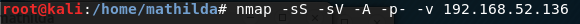
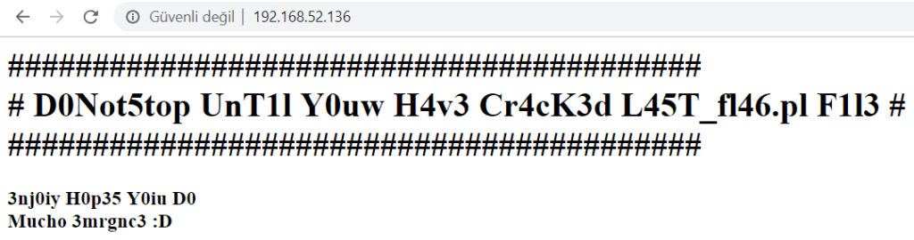
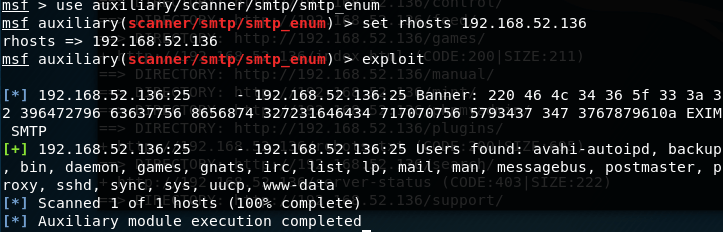
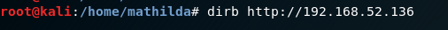
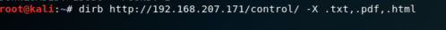
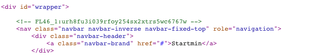
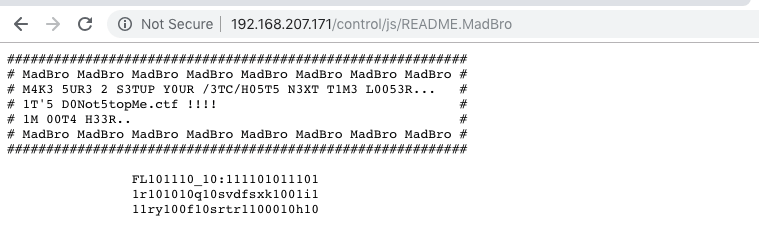
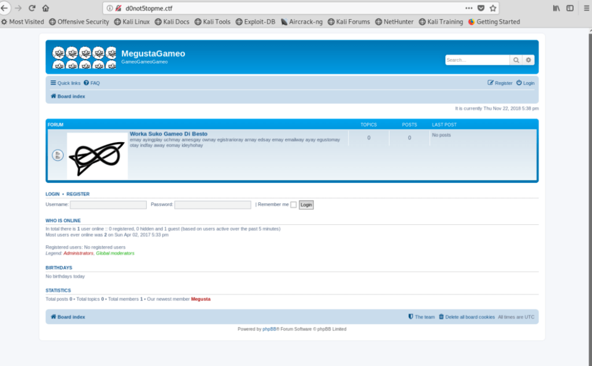

Attacker’S IP: 192.168.52.135/ 192.168.207.175
Victim’s IP: 192.168.52.136/ 192.168.207.171

If you just learn which machine is host up, you can use -Pn parameter in nmap.

Let’s see web site:

## SMTP

SMTP(Simple Mail Transfer Protocol), is a TCP/IP protocol used in sending and receiving e-mail. Mail can be sent via SMTP, SMTP traffic can be listened to, the name and domain of the server can be detected, current users can be detected.

The SMTP Enumeration module will connect to a given mail server and use a wordlist to enumerate users that are present on the remote system.

And using metasploitable:

We found a lot of users. Also doing a banner grab on the smtp port gives us an interesting string. So Decoding with xxd gives us another flag!

And I’m looking at the paths included in the site:

Then I saw two paths.

- http://192.168.207.171/control/hosts.txt
- http://192.168.207.171/control/index.php

When I look source code index.php:

Okey, I have another flag. So I continue to look at the path of the dirb result.

I have another flag decoder with binary. FL46_2:39331r42q2svdfsxk9i13ry4f2srtr98h2
Also I saw a note. Seems like there is a virtual host so i added d0not5topme.ctf to my /etc/hosts.
It gave me register form Board Administrator link. I clicked Register and select to “I do not agree to these terms”.

I used burp as a proxy and in the register.

So I saw FLaR6yF1nD3rZ_html. And I tried to go this path: http://d0not5topme.ctf/FLaR6yF1nD3rZ_html.
This path give me text that brainfuck encoder. And I decoded:

I have another flag.