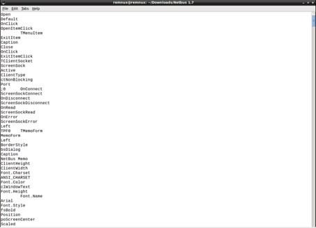

NetBus is one of the oldest malicious software. Contains NetBus.exe and patch.exe.

The most damaging file is Patch. Clicking on this file opens the port and starts listening. Connection to Bind Shell type. The features of a RAT are present in this trojan (screenshoot, CDrom turn-off, Bind socket connection, etc.). The local IP address is 127.0.0.1, which is the default loopback IP address that is used to establish the connection in the NetBus panel.

We start our analysis by setting the API from the key variable in the python script file on Remnux.

### Static Analysis with Hash Value

The summary values of the trojan were taken with the md5sum tool on Remnux. 

When we examine the summary value of patch.exe with vttool tool, 41 antivirus said that this file is trojen.

Similarly, when we examine the summary value of NetBus.exe, 32 antivirus has said that this file is trojan.

### Review with Strings

When this file is examined with the Strings command, certain words give us information about what the trojen does.

When we look at the exe file with grep filter, we can see more clear results.

The GDI32.dll that the trojan uses is a dll file that is used for graphical operations on Windows platforms. It can be estimated from the printout where the trojan can link to casino.com. We can also comment on the possibility that the trojan will also be able to perform the e-mail transactions. If we want to examine the process of sending mail in more detail we can learn certain information from string expressions.

