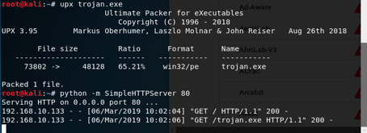
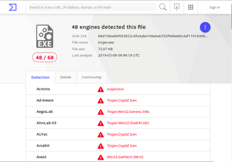

The hacker, who is the malware writer, tries to prevent the code from being detected and analyzed by a reverse engineer by making a number of obfusucating code or packaging to prevent the code from being recognized. But each program that uses obfusucating or packaging is not harmful because some legal products may use this method to prevent programs from being cracked.

To examine these types of malware, we’ll produce a trojan that is made on both our packaging and obfusucating on Kali ourselves.

I created and encoded the malware file. And then I pack it with UPX.

When we uploaded the file to VirusTotal, that told us it was harmful.

Using the PEID, which is one of the tools used in the malware analysis phase, we can see whether the malicious file is packaged.

The UPX1, which we see in the EP Section, tells us that the file is packaged.
I opened the code with the UPX opener.

When I analyzed the code with the strings tool; It is seen that DLL files like ntdll.dll, shel32, ws2_32, mswsock, advapi32, kernel32 are used by malicious.

What happens in these files:

**Ntdll.dll:** This dll file is not imported directly. Windows kernel is used to communicate with the operating system. Called indirectly from the Kernel32.dll file. If Ntdll.dll is being imported directly, you may be trying to store malicious functions or manipulate processes.

**shell32.dll:** Used to execute commands given at the command line.

**ws2_32:** Used to open the connection over the network.

**advapi32.dll:** User sided button is the dll file used for visual design, such as the drag bar and other components.

**kernel32.dll:** is a dll file where functions such as access, manipulation and manipulation of memory, files and hardware commonly used by malware and exploit codes are performed.
