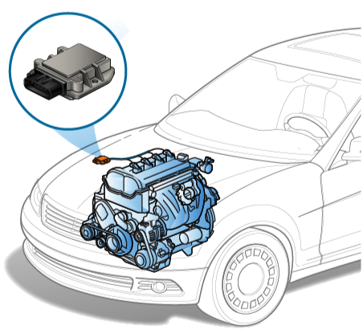
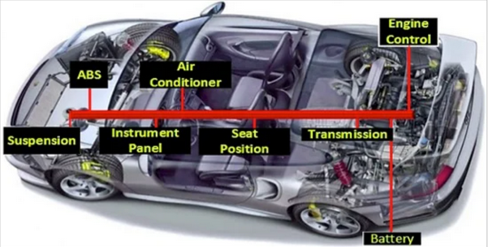
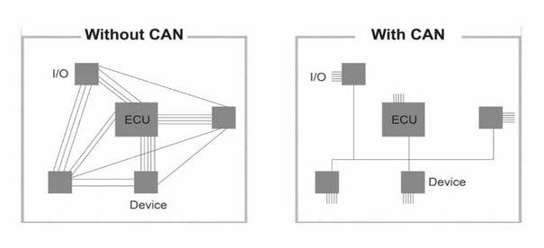
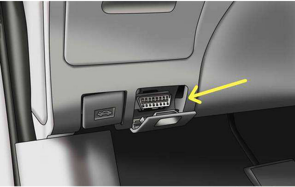
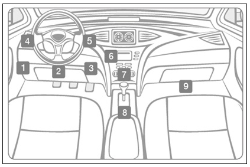

## EKU (Electronic Control Unit)

An electronic control unit (ECU) is a small device in a vehicle’s body that is responsible for controlling a specific function. 

Today’s vehicles may contain 100 ECUs or more, controlling functions that range from the essential (such as engine and power steering control) to comfort (such as power windows, seats and HVAC), to security and access (such as door locks and keyless entry). ECUs also control passive safety features, such as airbags, and even basic active safety features, such as automatic emergency braking.

## CAN (Controller Area Network)

CAN is the first vehicle communication network to enter mass production in the automotive industry. Today, it has become standardized and even used in many different fields from automation technologies to biomedical products. This is because it is both low cost and reliable.

CAN is used in many different areas, from engine management to air conditioning, from charging systems in hybrid vehicles to power steering. Of course, the data rate required by each area is different. For example, the communication in the engine requires being faster than the communication in comfort. Therefore, CAN network communication for each system is integrated with different data transfer rate.

According to the data transfer rate, it is possible to talk about 2 types of CAN communication networks:

### High speed CAN (CAN-C):

- Data transfer rate is from 125 kBit/s to 1 Mbit/s
- Used in the following systems: Engine management, electronic transmission, ride stability systems (such as ESP), instrument cluster

### Low speed CAN (CAN-B):

- Data transfer rate is from 5 kBit/s to 125 kBit/s
- Used in the following systems: Climate management, seat adjustment, power window, sunroof, side mirror adjustment, interior lighting, navigation system management

### CAN FD (Flexible Data Rate CAN):

- The latest version of CAN offers a flexible data rate, more data per message, and much higher speed transfers. The data length in each standard (low speed and high speed) CAN message is 8 bytes, but with CAN FD this has been increased by 800% to 64 bytes. In addition, the maximum data rate has been significantly increased from 1 Mbps to 8 Mbps.

## OBD (On-board Diagnostics)

For motor vehicles, OBD I and OBD II standards have started to be implemented in the USA and EOBD standards in European countries.

It was possible to control all the equipment on the vehicle electronically, to diagnose the faults instantly, to record them in the fault memory and to read the faults at any time. When a malfunction occurs in the engine, the eOBD turns on the malfunction lamp.

The OBD-II port is usually located under the dashboard, beneath the steering wheel column (1 - 3 in the diagram below). If not located beneath the steering column, look for the port in the areas indicated by numbers 4 - 9.