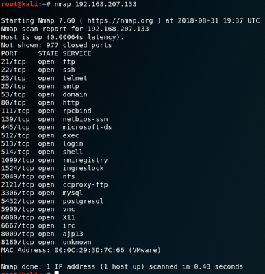

## EKU (Electronic Control Unit)

An electronic control unit (ECU) is a small device in a vehicle’s body that is responsible for controlling a specific function. 

Today’s vehicles may contain 100 ECUs or more, controlling functions that range from the essential (such as engine and power steering control) to comfort (such as power windows, seats and HVAC), to security and access (such as door locks and keyless entry). ECUs also control passive safety features, such as airbags, and even basic active safety features, such as automatic emergency braking.

